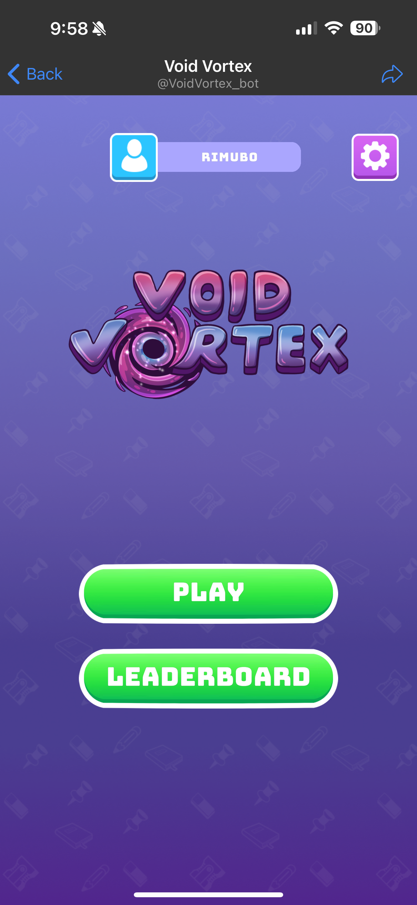
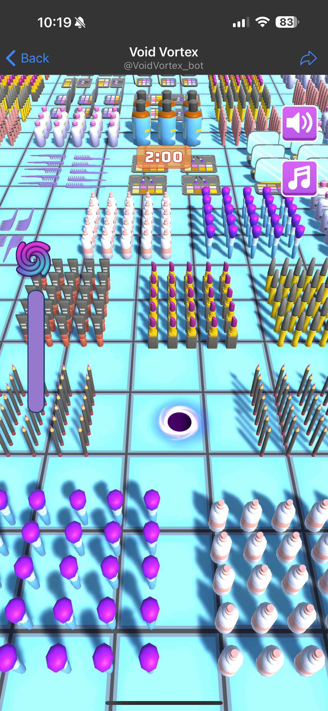
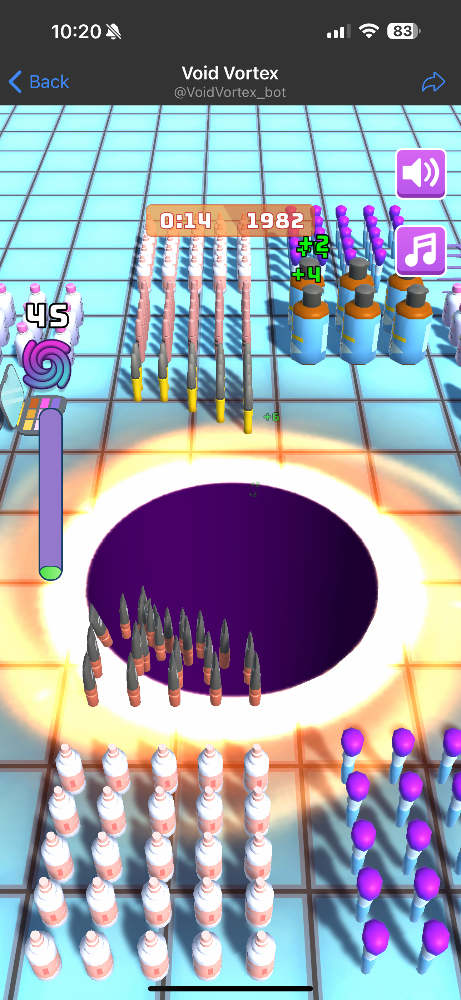
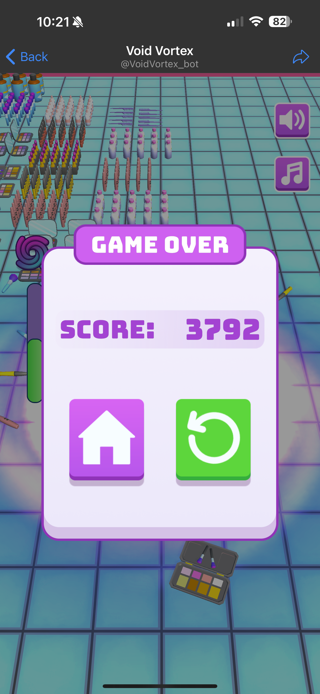
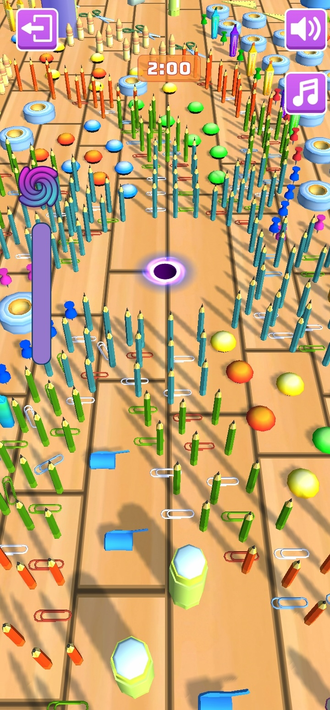
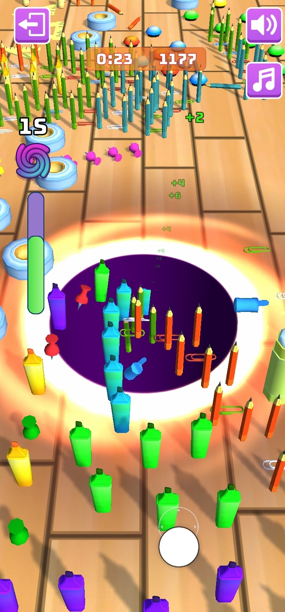

# Void Vortex

## Table of Contents

- [About the Project](#about-the-project)
- [Links](#links)
- [Features](#features)
- [Technologies Used](#technologies-used)
- [Screenshots](#screenshots)
- [License](#license)
- [Contact](#contact)

## About the Project

It’s a hyper-casual game for Web, iOS, Android, and as a Telegram bot made by Mind Studios Game. In the game, players have maps of objects and a black hole, a.k.a. the Void Vortex. The objective is to move the vortex to “swallow” as many objects into the void as you can within the allotted time. The more objects fall into the void, the bigger the void vortex gets, thus becoming able to eat up bigger objects. When the time is up, players get a final score based on the number and size of objects they caught.

## Links

Great introWebGL version: https://themindstudiosgames.github.io/Void-Vortex-WebGL/

Telegram: https://t.me/VoidVortex_bot

## Features

1. User creation
1. Nickname registration
1. A number of different maps with objects, categorized by themes
1. Moving the vortex to swallow objects
1. Booster feature
1. Scoring system
1. Leaderboards with PlayFab integration

## Technologies Used

* Unity
* Zenject
* UniRx
* DOTween
* PlayFab
* Shader Graphs
* Cinemachine

## Screenshots

#### Telegram bot

  
  
  
  

#### Android

  
  

#### WebGL

  
  

## License

This project is proprietary and all rights are reserved. No part of this codebase may be reproduced, distributed, or transmitted in any form or by any means, without the prior written permission of the author. Unauthorized use, reproduction, or distribution of this code is strictly prohibited.
For inquiries regarding permissions or licensing, please contact:
* Mind Studios Games
* Email: [games@themindstudios.com](mailto:games@themindstudios.com)
* Website: https://themindstudios.com/games/

## Contact

* Created by Mind Studios Games
* Email: [games@themindstudios.com](mailto:games@themindstudios.com)
* Website: https://themindstudios.com/games/
* LinkedIn: [Mind Studios Games](https://www.linkedin.com/company/mindstudiosgames/)
